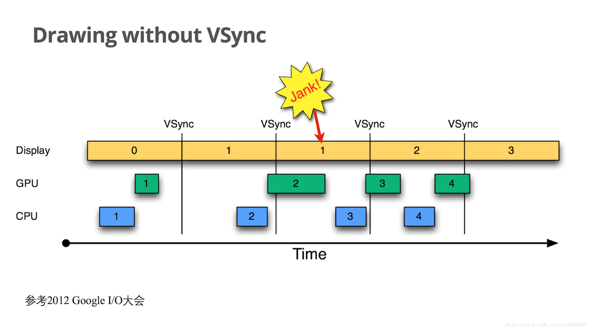
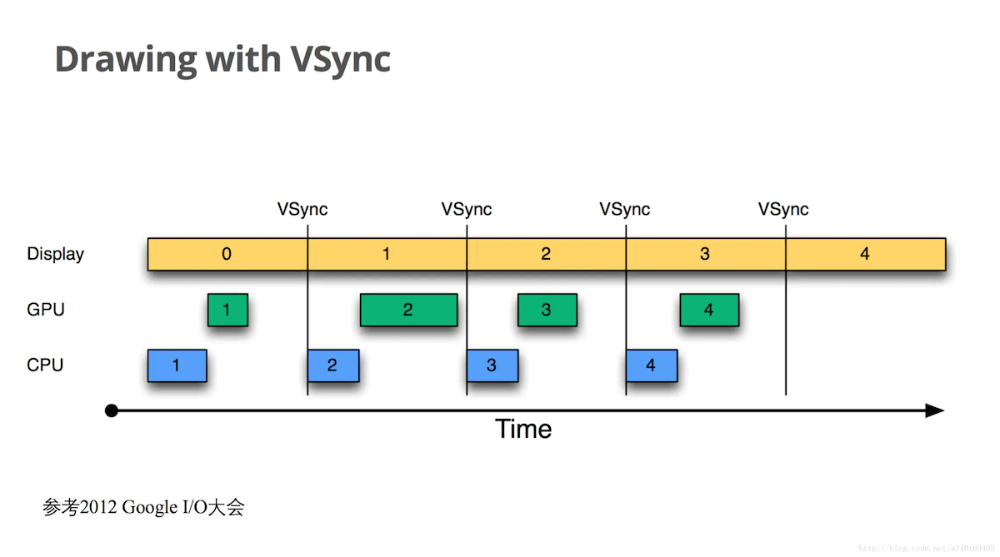
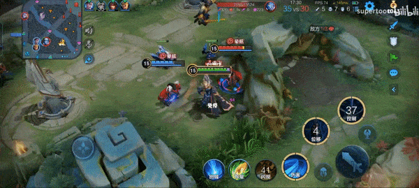
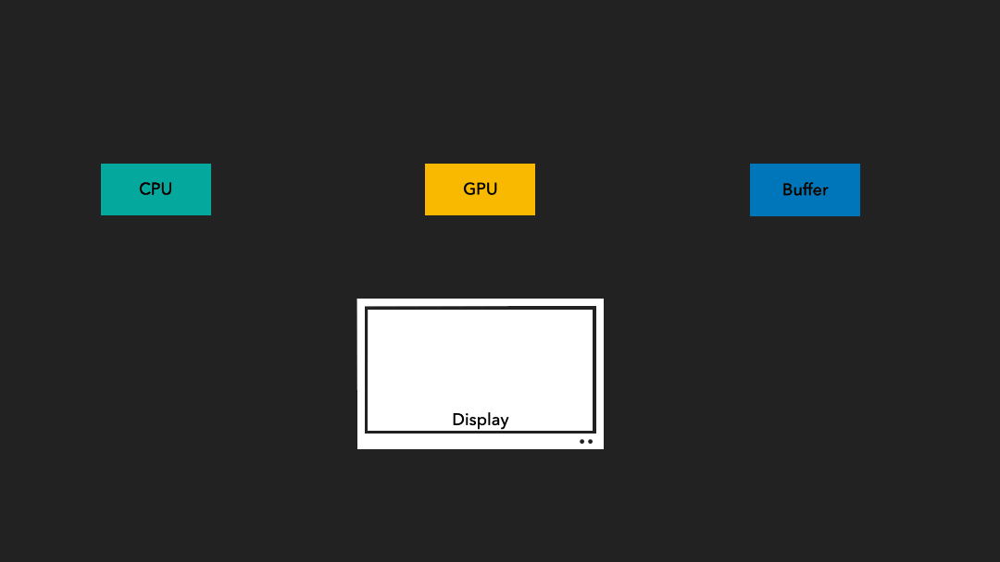
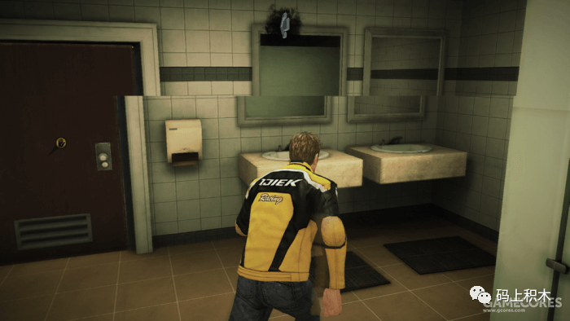
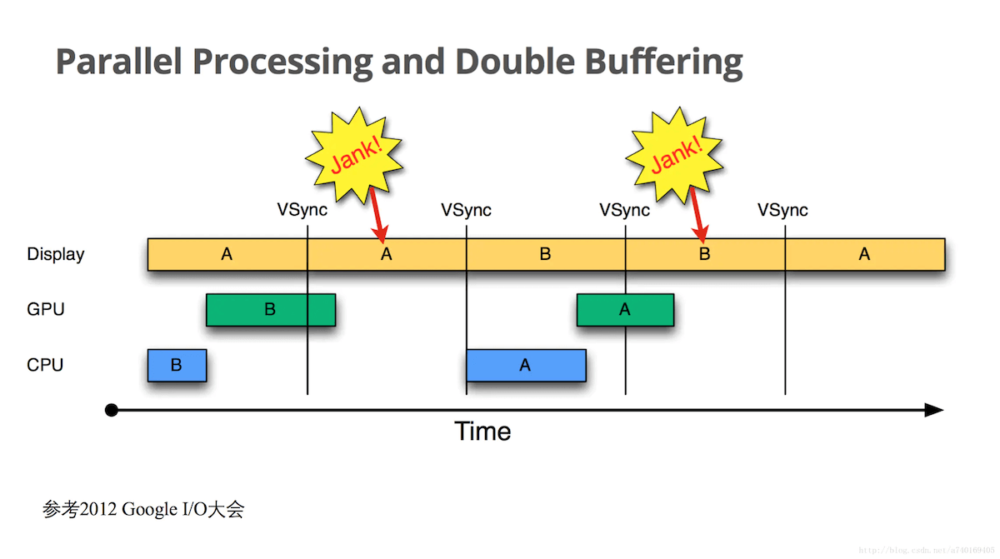
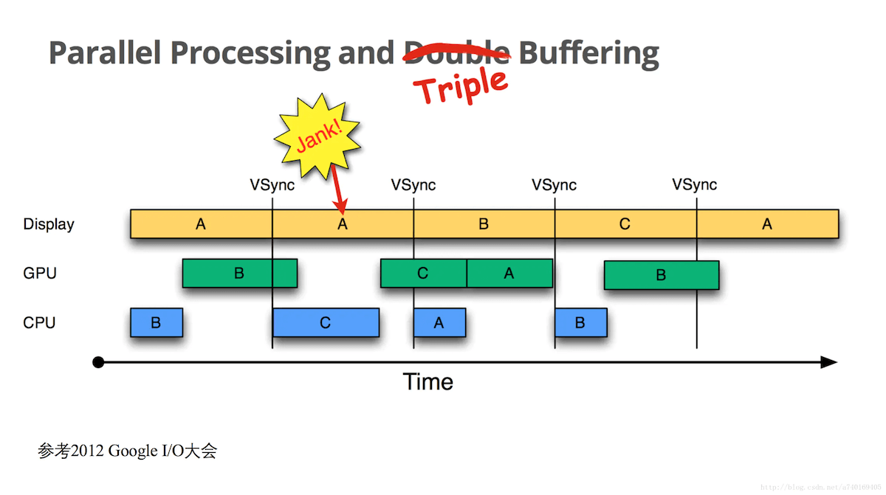

界面的显示其实就是Activity View树里所有的View进行测量、布局和绘制操作之后的结果，但这些工作完成后，屏幕不会马上刷新。应用只负责计算屏幕数据，接收到屏幕刷新信号就去计算，计算完毕就完成操作。至于屏幕的刷新，这些是由底层以固定的频率来切换屏幕每一帧的画面。所以即使屏幕数据都计算完毕，屏幕会不会马上刷新就取决于底层是否到了要切换下一帧画面的时机了。

在一个典型的显示系统中，一般包括CPU、GPU（俗称显卡）、display（如手机屏幕，电脑显示器）三个部分，CPU负责计算数据，把计算好数据交给GPU，GPU会对图形数据进行渲染，渲染好后放到buffer里存起来，然后display负责把buffer里的数据呈现到屏幕上；显示过程，简单的说就是CPU/GPU准备好数据，存入buffer，display每隔一段时间去buffer里取数据，然后显示出来。display读取的频率是固定的，比如每隔16ms读一次，但是CPU/GPU写数据是完全无规律的。

不带Vsync显示：

带Vsync显示：

对于60Hz刷新率的手机来说，屏幕刷新频率是16.6ms一次，但如果应用界面一直保持不动，并不会每16.6ms就刷新一次。安卓每隔16.6ms刷新一次屏幕其实是指底层会以这个固定的频率来切换每一帧画面，而这个每一帧画面数据就是我们的应用在接收到屏幕刷新信号后去执行遍历View树所计算出来的屏幕数据。应用不是每个16.6ms的屏幕刷新信号都会接收到，只有当应用向底层注册监听下一个屏幕刷新信号之后，才能接收到下一个屏幕刷新信号到来的通知，而只有当某个View发起了刷新请求时，应用才会向底层注册监听下一个屏幕刷新信号。也就是说只有当界面有刷新需要时，应用才会注册VSYNC信号，并在下一个屏幕刷新信号到来时遍历View树计算屏幕数据。如果界面没有刷新的需要，应用就不注册VSYNC信号。但底层仍然会以固定的频率来切换每一帧画面，只是后面这些帧的画面都是相同的而已。

避免丢帧的方法之一是保证每次绘制界面的操作要在16.6ms内完成，但注意到一个问题，请求绘制的操作在代码中被调用的时机是不确定的，比如用户点击屏幕上的按钮导致的刷新操作是在某帧16.6ms快结束时，那么即使这次刷新操作的时间小于16.6ms，不也会造成丢帧吗？这该如何理解？当某个View发起刷新请求时，重绘工作不会立即开始，而是要等到下一个屏幕刷新信号到来时才开始。

掉帧效果见：

#### 画面撕裂
具体效果见：

首先理解一个概念“逐行扫描”，意思是显示器显示画面并不是“蹭”一下就打出一张画面来，而是从上到下一行一行显示出来的，只不过是显示得比较快肉眼看不出来而已。

上文说到屏幕数据是从缓存区buffer中取的，如果在屏幕取数据并逐行扫描显示画面的过程中buffer中的数据改变了，那就有可能导致画面撕裂。例如显卡的fps是120，显示器的fps是60，也就是显卡一秒钟能产生120张图画，但显示器一秒钟只能读取60张图画，当显示器从buffer中读取数据逐行扫描过程中，本来需要1/60秒显示完一张画面，但是在1/120秒的时间点显卡就把下一张画面的数据存到buffer了，结果显示器的下半部分显示的就是第二张画面的内容了，就造成了画面撕裂。为了防止这种情况，显示系统就加入了双缓存和VSYNC。

首先开启VSYNC，将GPU的fps限制为和显示器的fps一样。系统会在显示器绘制完一帧之后发送一个垂直同步信号，然后CPU和GPU就准备下一帧的内容，等待显示器下一帧绘制完，又会发送一个垂直同步信号。如此反复，就限制了显卡的fps，按照显示器的标准来绘制图像。

其次通过双缓存保证一帧数据的连贯性。缓存区backBuffer用于CPU/GPU图形处理，缓存区frameBuffer用于显示器显示，这样分工明确之后，屏幕只会读取framebuffer的内容，是一帧完整的画面。而CPU/GPU计算的新一帧内容会放到backbuffer中，不会影响到framebuffer的内容。只有当屏幕绘制完一帧内容之后，才会将CPU/GPU计算好的新一帧内容也就是backbuffer内容和framebuffer进行交换。这样就保证了一帧数据的完整连贯。

#### Project Butter（黄油计划）
加入VSYNC和双缓冲后解决了画面撕裂的问题，但掉帧问题更严重了。如图：

虽然统一了CPU处理的时间点，但是掉帧问题可能会被再一次放大，从掉一帧直接变成后续一直掉帧。因为第二个的16.6ms被浪费了，CPU必须等到第三个16.6ms才能开始新一帧的数据处理，直接影响后续的所有帧进度。

为了解决这个问题，Android 4.1在Project Butter（黄油计划）中提出了Vsync同步信号和三缓冲，为的是就是让Android能让黄油/奶油般顺滑。

1. 缓存区backBuffer用于CPU/GPU图形处理 
2. 缓存区TripleBuffer用于CPU/GPU图形处理 
3. 缓存区frameBuffer用于显示器显示

刚才说的导致掉帧更严重的原因是在第二个VSync信号来的时候，因为backBuffer被占用，所以无法去开始新一帧的计算，加入第三个缓存区后，在第二个VSync信号来的时候，CPU/GPU就可以利用TripleBuffer开始新一帧的计算，而不会被目前正在占用的backBuffer阻塞。

#### 调试分析流程
> 将调试类型修改为“Dual（Java + Native）”
- 继承`Button`创建自定义View`MyBtn`，重写`onDraw`方法，启动应用观察到`onDraw`回调一次，保持界面不动`onDraw`不会回调，点击Button`onDraw`被回调。
- 因为点击Button时会触发`View#onTouchEvent`方法，所以以此为入口跟进绘制流程。单步调试观察到`View#onTouchEvent`中调用到了`View#invalidate`方法，继续单步往下跟进，执行到`View#invalidateInternal`中，此方法中调用了`p.invalidateChild`，在调试器中查看`p`变量（为了方便调试，在布局xml中为`MyBtn`的父布局指定一个id，即为P_ID），观察到`p`的`app:id`就是“P_ID”，进入`p.invalidateChild`继续往下跟，调用到`ViewGroup#onDescendantInvalidated`，其中调用了`mParent.onDescendantInvalidated`，此时`mParent`为`p`的parent（记为`pp`；如果`p`是Activity的根布局，则`pp`为“FrameLayout{android:id/content}”），
- 接着会递归往上级parent调用`onDescendantInvalidated`，直到`mParent`值为`ViewRootImpl`，此时就是直接调用了`ViewRootImpl#onDescendantInvalidated`，而此方法中也只是简单的调用了`ViewRootImpl#invalidate`，接着调用`ViewRootImpl#scheduleTraversals`
- 在`scheduleTraversals`中有一个标记`mTraversalScheduled`，执行过一次后被置为`true`，所以短时间内重复调用`invalidate`只有第一次有效
- 接着调用`postSyncBarrier`发了一个消息屏障，查看`MessageQueue#postSyncBarrier`的注释，当消息队列中有消息屏障时，消息队列中后续的同步消息将被暂停
- 接着调用`mChoreographer.postCallback(Choreographer.CALLBACK_TRAVERSAL, mTraversalRunnable, null);`，进入`postCallback`中，首先将`mTraversalRunnable`加入到了回调队列`mCallbackQueues`中，然后调用了`scheduleFrameLocked`
- `scheduleFrameLocked`中调用了`scheduleVsyncLocked`，继续往下跟，发现调用到了一个native方法`nativeScheduleVsync`，此时切换到NativeDebugger，点击“Pause Program”，打开LLDB调试窗口，输入`br s -M nativeScheduleVsync`，得到如下信息“Breakpoint 2: where = libandroid_runtime.so\`android::nativeScheduleVsync(_JNIEnv*, _jclass*, long), address = 0x00007a75a5488da0”，即`nativeScheduleVsync`方法是在“libandroid_runtime.so”中，执行`add-dsym /Volumes/aosp/android-10.0.0_r47/out/target/product/generic_x86_64/symbols/system/lib64/libandroid_runtime.so`添加符号文件，然后切换回JavaDebugger
- 放开断点继续执行，发现在`android::nativeScheduleVsync`处断住，在LLDB窗口中执行`source info `查看源码信息，然后执行`settings set target.source-map frameworks /Volumes/aosp/android-10.0.0_r47/frameworks`关联源码，继续执行即会在`nativeScheduleVsync`方法中断住，继续往下跟，最终回调回Java中`FrameDisplayEventReceiver#onVsync`，在`onVsync`中执行`Message.obtain(mHandler, this)`创建了一个消息，消息的callback是this（即FrameDisplayEventReceiver），所以执行了`FrameDisplayEventReceiver#run`，在run中执行`doFrame`，其中会执行上文被加入到回调队列中的`mTraversalRunnable`。
- 开始执行`mTraversalRunnable`，具体执行了`doTraversal`，先将上文`mTraversalScheduled`变量置回false，然后移除消息屏障，接着调用`performTraversals`
- `performTraversals`中依次执行了`performMeasure`、`performLayout`和`performDraw`。至此应用层的流程结束。
